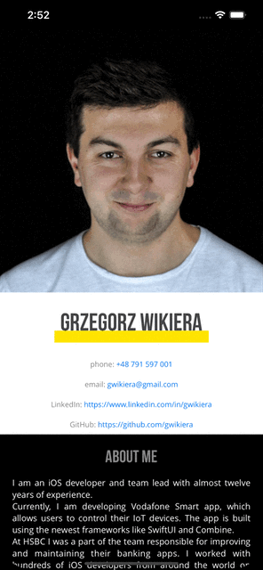

## CV

[](https://app.bitrise.io/app/58d6b8fa19361986)
[](https://app.travis-ci.com/gwikiera/CV)
[](https://codecov.io/gh/gwikiera/CV)

<!-- PROJECT LOGO -->
<div align="center">
  <a href="https://github.com/gwikiera/CV">
    
  </a>

  <p align="center">
   A showcase project, which fetches data and renders my CV.
   <br>
   It is also my playground project, where I like to play with architecture, design patterns, and technics.</p>
</div>


<!-- TABLE OF CONTENTS -->
<details>
  <summary>Table of Contents</summary>
  <ol>
    <li>
      <a href="#about-the-project">About The Project</a>
    </li>
    <li>
      <a href="#getting-started">Getting Started</a>
      <ul>
        <li><a href="#installation">Installation</a></li>
      </ul>
      <li><a href="#license">License</a></li>
    </li>
  </ol>
</details>

<!-- ABOUT THE PROJECT -->
## About The Project
<p align="center">
 
</p>

A simple iOS app is written in Swift.

UI was created using the `UIKit` framework. `SwiftUI` is used only to enable previews of the views. New views will be created in `SwiftUI`.

The app is not built using only one architecture, but each view uses only one of them. Currently used architectures: 
* Clean Swift
* MVVM

All the code is written in a testable way. Unit tests are written using `XCText`, `Quick`, and `Nimble` frameworks.

[Bitrise](https://app.bitrise.io/app/58d6b8fa19361986) and [Travis CI](https://app.travis-ci.com/gwikiera/CV) are used for CI, [Codecov](https://codecov.io/gh/gwikiera/CV) for measuring code coverage.

[SwiftLint](https://github.com/realm/SwiftLint) is used for linting the Swift source code. It is added to the project as a build phase. 

<p align="right">(<a href="#top">back to top</a>)</p>

<!-- GETTING STARTED -->
## Getting Started

To run the project only Xcode is needed (version 13+). All the project dependencies will be fetched automatically by the Swift Package Manager. 

### Installation

1. Clone the repo
   ```sh
   git clone https://github.com/gwikiera/CV.git
   ```
2. Open the `CV` Xcode project
   ```sh
   cd CV
   open CV.xcodeproj
   ```

<p align="right">(<a href="#top">back to top</a>)</p>

<!-- TECHNICAL DESCRIPTION -->
## Technical description

### Architecture

The app is not based on only one architecture. Different screens were built using different approaches. Currently used architectures: 
* **Clean Swift** - [Image](./Modules/Sources/CV-UIKit/Image) is an example. [ImageViewController](./Modules/Sources/CV-UIKit/Image/ImageViewController.swift) informs [ImageInteractor](./Modules/Sources/CV-UIKit/Image/ImageInteractor.swift) about actions. [ImageInteractor](https://github.com/gwikiera/CV/blob/develop/Modules/Sources/CV-UIKit/Image/ImageInteractor.swift) contains the bussiness logic, and perform work using its workers, at the end informs [ImagePresenter](./Modules/Sources/CV-UIKit/Image/ImagePresenter.swift) about new data to be presented. [ImagePresenter](./Modules/Sources/CV-UIKit/Image/ImagePresenter.swift) based on received data formats it to the format undestandable by [ImageViewController](./Modules/Sources/CV-UIKit/Image/ImageViewController.swift). At the end of the `VIP` cycle [ImageViewController](./Modules/Sources/CV-UIKit/Image/ImageViewController.swift) display new data to the user.
* **MVVM** - [CLE](./Modules/Sources/CV-UIKit/CLE) is an example. [CLEViewController.swift](./Modules/Sources/CV-UIKit/CLE/CLEViewController.swift) listen to the stream of [CLEViewState](./Modules/Sources/CV-UIKit/CLE/CLEViewState.swift) model objects from passed [CLEViewModel](./Sources/CV-UIKit/CLE/CLEViewModel.swift). [CLEViewController.swift](./Modules/Sources/CV-UIKit/CLE/CLEViewController.swift) triggers some actions on [CLEViewModel](./Sources/CV-UIKit/CLE/CLEViewModel.swift), which may end up with new data comming in.

### Modularization
The app is modularized into many small modules using Swift Package Manager. Each module is standalone and designed to deliver specific functionality. Some modules have dependencies on other local or remote modules. Tests for modules are written in the dedicated test targets. The main advantages of using modularization are the ability to build each module in a separation, speed up the process of testing and previewing `SwiftUI` code, and the potential to extract some modules into separate repositories. 

### Dependency injection
Dependencies in the app were constructed using the [pointfree.io](https://www.pointfree.co/collections/dependencies) style. Instead of using `protocols` to define abstraction, it uses `structs` initialized with closures for each dependency functionality, [APIClient](./Modules/Sources/Networking/APIClient.swift) is an example. It allows tp define many static objects which creates `live`, `mock` or `failing` implementations of this `struct`, like in [APIClientLive](./Modules/Sources/NetworkingLive/APIClientLive.swift). Using `var`s allows to easily change one of the closures of `failing` implementation for tests purposes (those `var`s are not `public` so the client app or module cannot change them). 

The app dependencies are grouped inside the [AppEnvironment](./CV/AppDelegate/AppEnvironment.swift) struct. It allows changing the app environment based on the passed launch arguments. Due to that, the project contains two schemas: live `CV` and `CV-Mock`, which operate on the hardcoded data.

### Testing

### CI

<!-- LICENSE -->
## License

Distributed under the Apache  License. See [LICENSE](LICENSE) for more information.

<p align="right">(<a href="#top">back to top</a>)</p>
